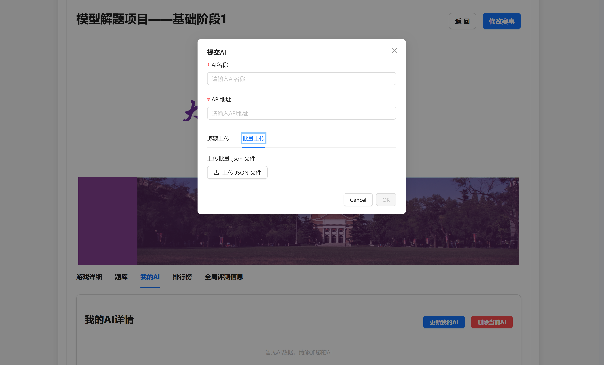
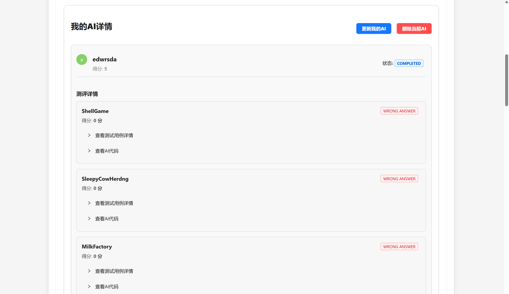
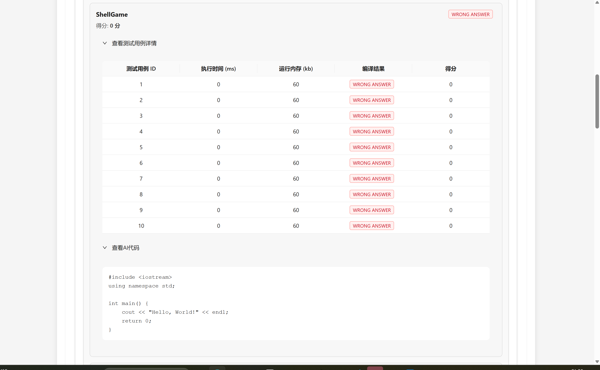

## 提交格式要求

支持逐题上传和批量上传两种方式

=== "逐题上传"

    用户需要在提交页面单独上传赛事中每一道题的cpp代码文件，后缀名必须为`.cpp`，否则不予接受

=== "批量上传"

    批量上传需要用户提交一个json文件，格式如下：

    ```json
    [
        {
            "question_id": 1,
            "code_file": "int main() { return 0; }"
        },
        {
            "question_id": 12,
            "code_file": "int main() { return 1; }"
        },
        {
            "question_id": 13,
            "code_file": "int main() { return 0; }"
        },
        ...
        {
            "question_id": 20,
            "code_file": "int main() { return -1; }"
        }
    ]
    ```

    需要确保：

    - json文件中有且仅有一个数组
    - 数组中每个元素有`question_id`和`code_file`两个条目
        - question_id 字段对应题目的编号，编号和具体内容的关系可以在赛事题库中找到
        - code_file为一个字符串，代表上传的可以通过编译的代码，其有如下要求：
            - 按照 OI 赛制，我们要求提交单文件代码，标准为 C++11，请勿使用不包含在标准库内的第三方库，否则可能引起编译错误
            - 代码大小不能过大，否则可能引起评测异常或无法上传等问题
    - 前端会检查格式，格式错误会拒绝上传并弹出提示栏

    上传界面：

    

## 评测操作说明

提交AI成功之后请等待评测结果，由于单次评测涉及较多题目，评测时间大致为 1-2 分钟，如果太长时间没有响应，用户可以在评测状态显示`RUNNING`时点击**删除当前AI**，然后重新提交自己的AI，这将取消当前评测并发起一次新的评测

## 评测结果说明

评测完成后，用户可以在**我的AI详情**中查看整体赛事信息



也可以查看每一道题的所有测试点信息和该题的代码，用户总得分为每一道题得分的平均值



## 排行榜

提供一个排行榜页面，降序展示所有参赛者在此题的得分


## 全局评测信息

每次进入该页面都会实时获取当前时间所有用户在该赛事的评测状态


