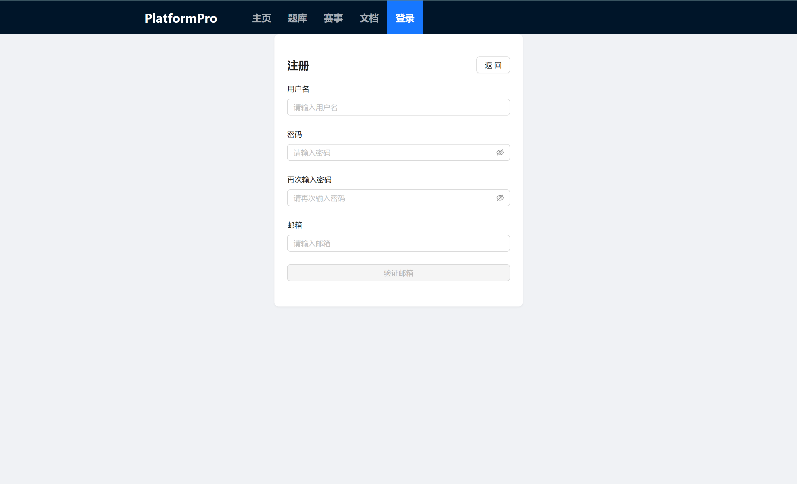
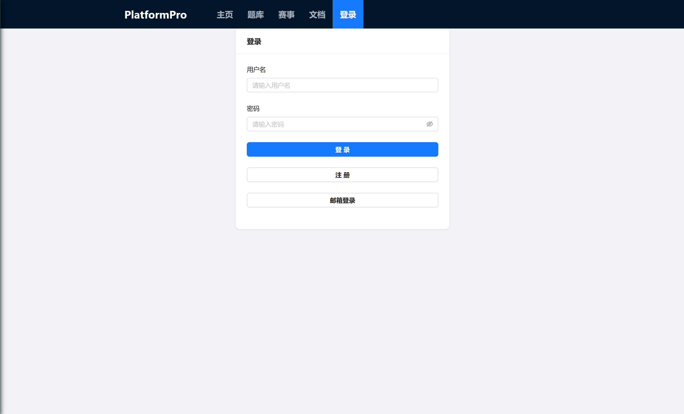
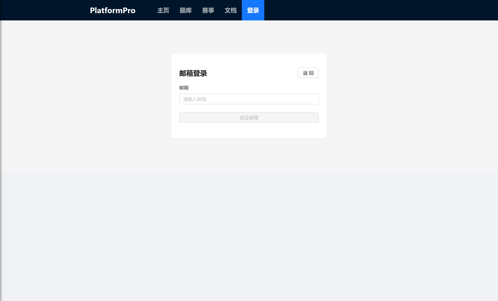
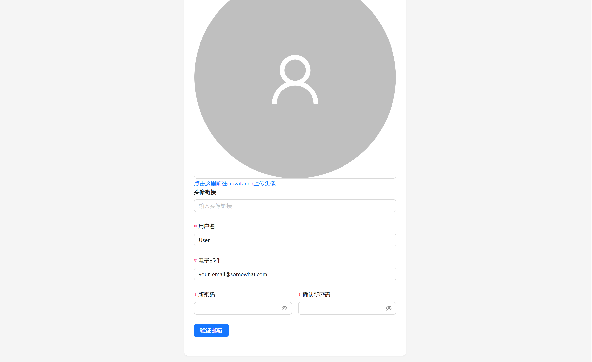
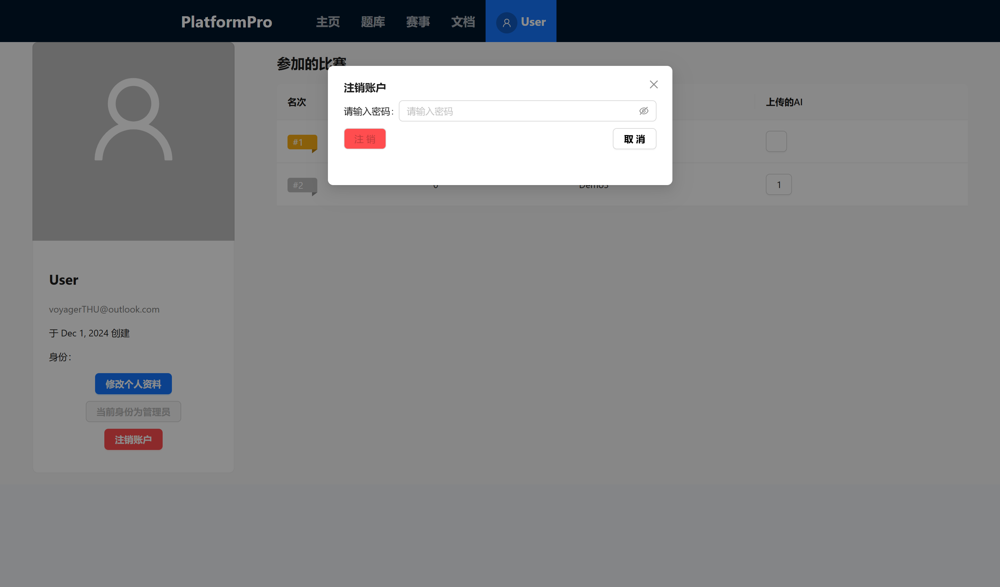

## 用户注册

注册界面如下，要求：

- 用户名不长于50个字符
- 用户密码不长于20个字符
- 邮箱符合正常格式

<!-- 插入media/image.png图片 -->

注意邮箱与用户账号一一绑定，注册时向用户邮箱发送验证码，需验证成功方可注册

## 用户登录

支持两种登录方式：密码登录和邮箱登录

密码登录：

邮箱登录：

## 用户资料

用户可以上传头像链接，每次修改用户信息需要邮箱认证

## 账号注销

用户可以注销当前账号，注意这会删除与此用户相关的一切数据，注销时需要输入用户密码

