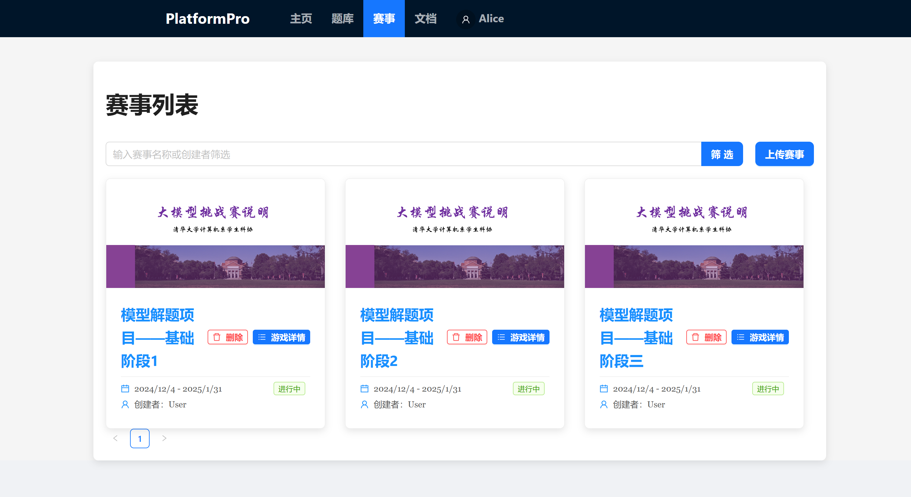
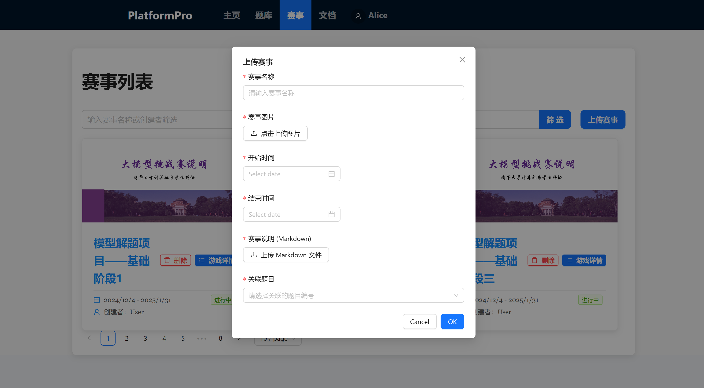

## 赛事列表

展示当前的所有赛事，每个赛事显示赛事图片、进行时间、创建者、当前状态

## 赛事详情

包含赛事详细、题库、我的AI、排行榜、全局评测信息，在**AI评测相关**文件中详细说明

## 管理员相关

### 上传赛事

图片部分可以直接上传本地文件，后端会存储下来并正确展示；可以按名称选择赛事关联题目

### 修改和删除赛事

无特殊要求，请尽量不要在赛事进行中修改与赛事关联的题目，这将导致先提交和后提交的用户评测的题目不同