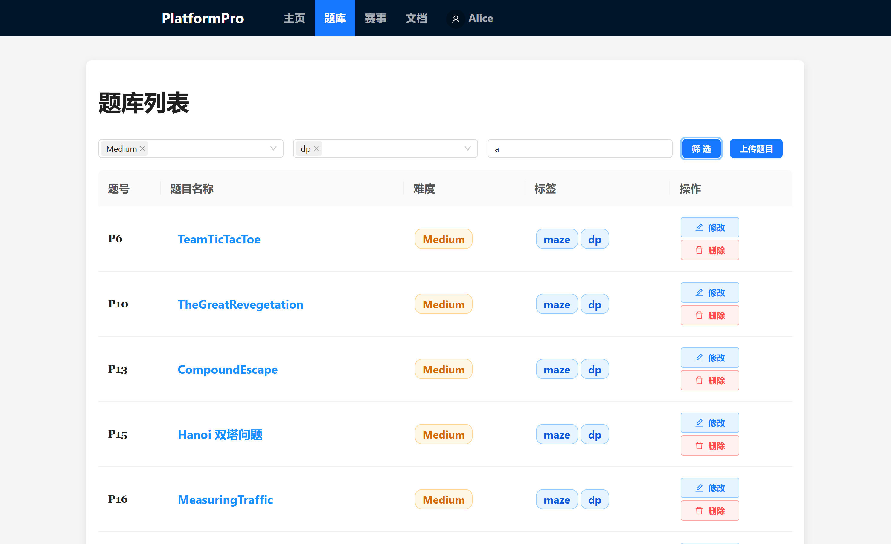
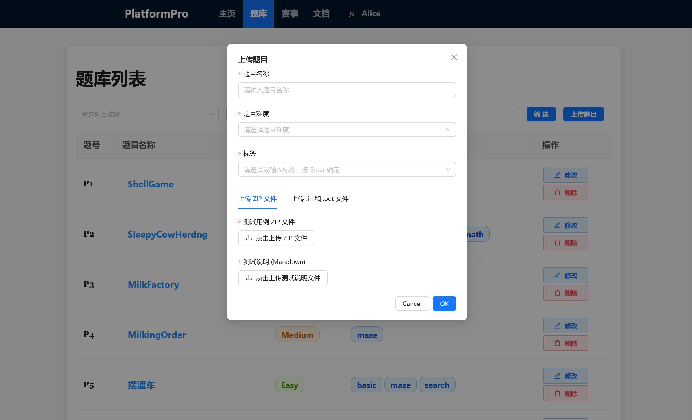
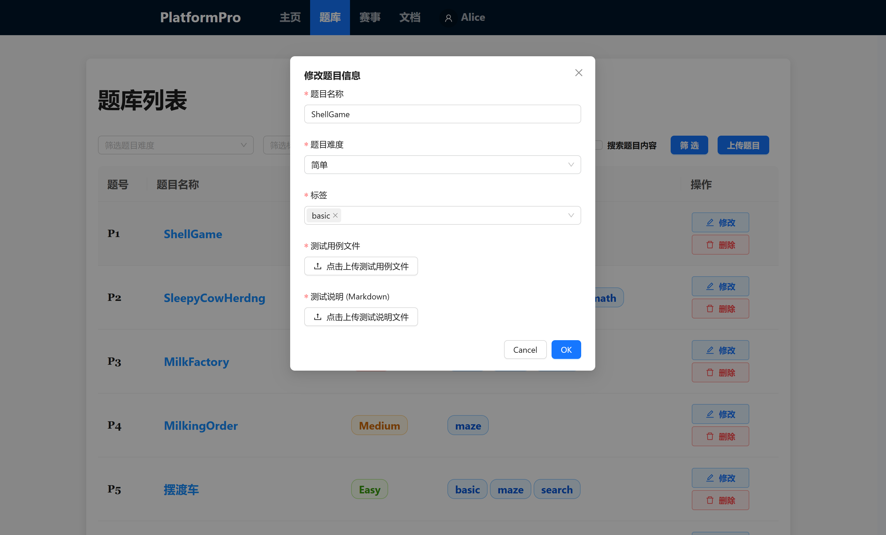

## 题目列表

题目列表显示每道题的序号、名称、难度、标签，其中难度有`Easy`、`Medium`、`Hard`三档，标签目前有`math`、`basic`、`maze`、`search`、`graph`、`dp`，支持按照名称、难度、标签筛选题目



## 题目详情

展示题目具体信息，支持Markdown和Latex


## 管理员相关

### 上传题目



支持.in & .out 直接上传和ZIP上传，要求：

=== ".in & .out 直接上传"

    上传若干测试点文件，应该为这种格式

    ```txt
    data1.in
    data1.out
    data2.in
    data2.out
    ...
    data10.in
    data10.out
    ```

    测试点数量不限，但要求文件名部分为**前缀+序号**格式，序号从1开始递增，前缀名应为英文字母的组合

=== "ZIP上传"

    要求ZIP中根目录下所有文件为**.in & .out 直接上传**的格式

### 修改与删除题目

为了不干扰赛事进行，不允许管理员修改或删除正在一个赛事中的题目，需要先删除与该题目关联的所有赛事之后再修改或删除题目



修改时上传的测试点会覆盖原有测试点，要求与**上传题目**的要求相同